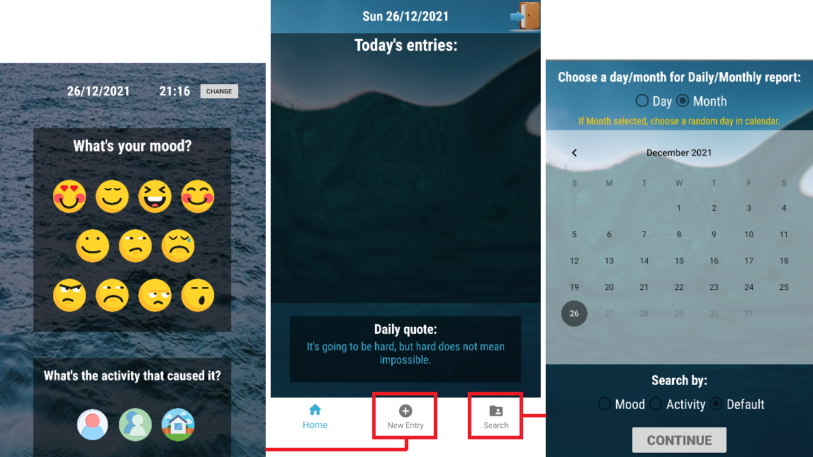

# MoodCareApp

MoodCare App in Java, Android Studio. 
Final project in an app development course.  

The app lets you track daily activities and patterns that affect your mood. 

## Created with:
* Android studio: Java.
* Android version: 11
* SDK version: 30
